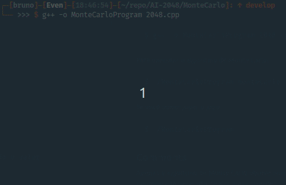

# A Simple Artificial Intelligence and a Monte Carlo Algorithm for the 2048 game.

Monte Carlo Algorithm:



#
[Portuguese](README_pt.md)

## Requirements
* C/C++ compiler.

## To run AI:

In the root folder. Run:
```
$ g++ -o AIProgram 2048.c
$ ./AIProgram
```

## To run Monte Carlo Algorithm
In the "MonteCarlo" folder.

To compile:

```
$ g++ -o MonteCarloProgram 2048.cpp
```

To run Monte Carlo Algorithm:
```
$ ./MonteCarloProgram montecarlo
```

If you want to play the game:

```
$ ./MonteCarloProgram
```

## Comments
Only the Monte Carlo algorithm achieved good results, reaching 4096 in the game. However, AI needs some corrections.
#
The game interface was based on <a href="https://github.com/mevdschee/2048.c">mevdschee/2048.c</a>.
